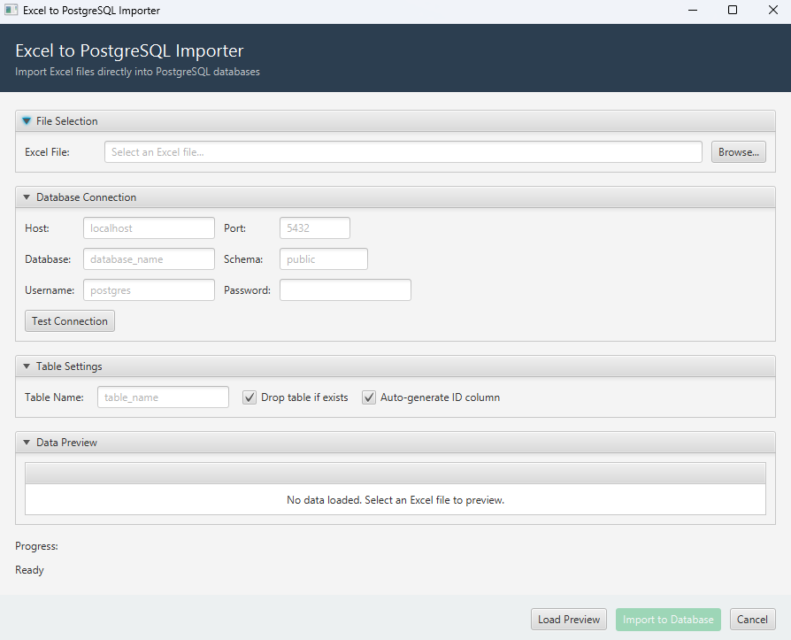

# Excel to PostgreSQL Importer

1. Download the ZIP
2. Run the .exe
3. Choose .xlsx file
4. Deliver database's information
5. Test connection
6. Write down a table name
7. Import to Database



A robust, JavaFX-based desktop application that seamlessly imports messy, unstructured Excel files (`.xlsx`, `.xls`) directly into a PostgreSQL database.

The tool takes the headache out of data migration by automatically scanning your Excel sheets, inferring the correct SQL data types, safely handling "phantom" empty rows, and executing high-performance batch inserts.

## ✨ Key Features

* **Dynamic Type Inference:** Automatically scans columns to determine if they should be `INTEGER`, `DECIMAL`, `BOOLEAN`, `DATE`, or `VARCHAR` in the database.
* **Smart Date Handling:** Parses underlying Excel decimal values and correctly translates masked visual dates (e.g., `44562.0` into `2022-01-01`).
* **Phantom Data Protection:** Intelligently bypasses invisible formatted cells, hidden columns, and empty rows so your database doesn't crash on `NULL` inserts.
* **Responsive JavaFX UI:** All heavy database operations and file parsing run on background threads via `javafx.concurrent.Task`, ensuring the UI never freezes.
* **Auto-Table Creation:** Automatically generates the SQL `CREATE TABLE` statements based on your Excel headers and optionally drops existing tables.
* **Dynamic Database Configuration:** Connect to any PostgreSQL instance dynamically via the UI without hardcoding credentials.

## 🛠️ Tech Stack

* **Language:** Java 21
* **UI Framework:** JavaFX
* **Excel Parsing:** Apache POI (`poi`, `poi-ooxml`)
* **Database:** PostgreSQL & JDBC Driver

## 🚀 Installation & Setup

1. **Clone the repository:**
   ```bash
   git clone [https://github.com/Har4oo/ExcelToSQL.git](https://github.com/Har4oo/ExcelToSQL.git)
   cd ExcelToSQL
